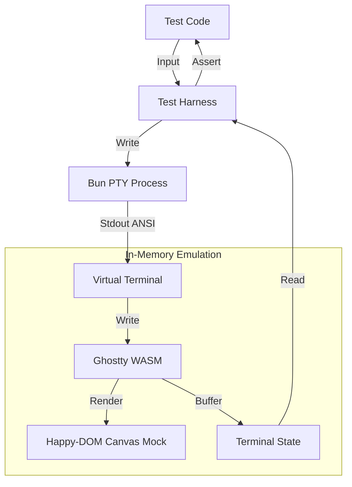
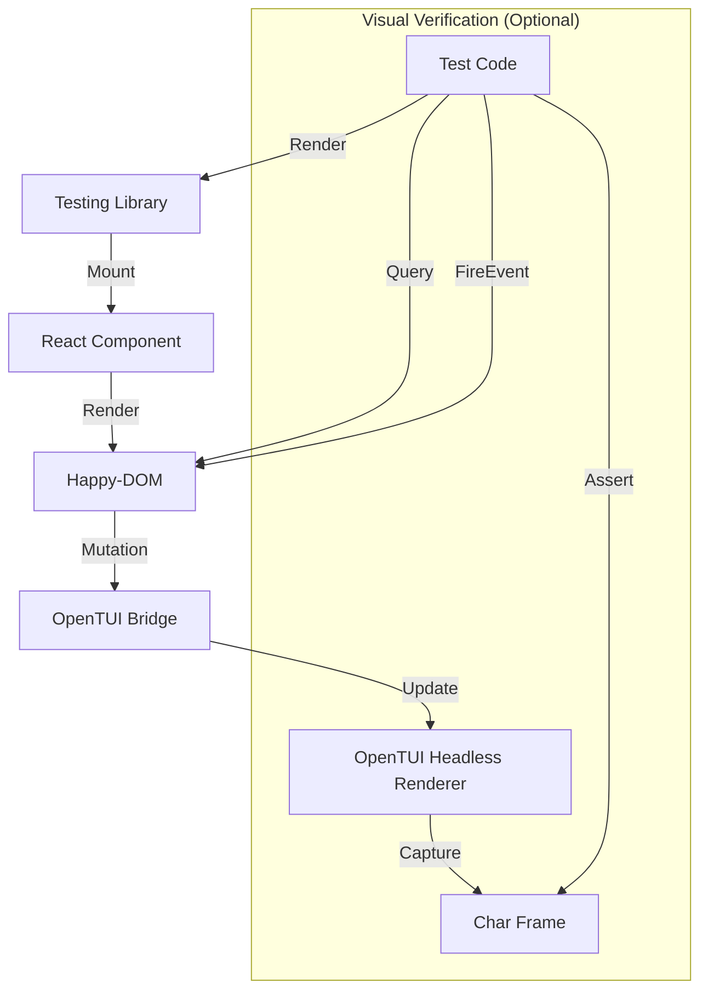

# Design: TUI DOM Testing

## 1. `@effect-native/tui-testing-library`

This library provides "Black Box" testing for any CLI/TUI application by spawning it in a PTY and verifying the visual output using a high-fidelity virtual terminal emulator.

### Architecture

We leverage **Ghostty** (via `ghostty-web` WASM) running inside **Happy-DOM** to accurately parse ANSI escape sequences, cursor movements, and text attributes. This avoids the complexity and brittleness of regex-based ANSI parsing.



### Core Components

#### 1. Virtual Terminal Engine
*   **Technology:** `ghostty-web` (WASM) + `@happy-dom/global-registrator`.
*   **Role:** Acts as the "screen". It receives raw bytes from the PTY and updates its internal buffer state, handling all VT100/ANSI complexity (colors, cursor jumps, clear screen, alternate buffer).
*   **Setup:**
    *   Preload `happydom.ts` to mock `window`, `document`, and `HTMLCanvasElement.getContext('2d')`.
    *   Initialize `Ghostty.load()` once per test suite.
    *   Create `new Terminal()` instances per test.

#### 2. Process Manager
*   **Technology:** `Bun.spawn({ terminal: ... })`.
*   **Role:** Spawns the target application in a real pseudo-terminal.
*   **IO:**
    *   Pipes PTY `data` events directly to the Virtual Terminal's `write()` method.
    *   Exposes a `write` method to send keystrokes to the PTY `stdin`.

#### 3. Screen Reader (Snapshotting)
*   **Technology:** Adapted from OpenCode's `SerializeAddon`.
*   **Role:** Extracts the current state of the Virtual Terminal buffer into verifiable formats.
*   **Formats:**
    *   `text()`: Plain text representation (strips colors).
    *   `ansi()`: Text with ANSI codes preserved (for snapshot testing).
    *   `cells()`: 2D grid of objects `{ char, fg, bg, bold, ... }` for precise assertions.

### API Design

```typescript
// Framework-agnostic harness
interface TuiHarness {
  // Process Control
  write(input: string): Promise<void>
  press(key: string): Promise<void> // Helper for escape codes (ArrowUp, etc.)
  resize(cols: number, rows: number): void
  kill(): void

  // Screen Inspection
  screen: {
    text(): string        // Full screen as string
    lines(): string[]     // Array of lines
    cell(x: number, y: number): CellInfo
  }

  // Async Utilities
  waitFor(predicate: (screen: Screen) => boolean, timeout?: number): Promise<void>
  waitForText(text: string): Promise<void>
  waitForStable(duration?: number): Promise<void> // Wait until output stops
}

// Factory
function spawnTui(command: string[], options?: TuiOptions): Promise<TuiHarness>
```

### Implementation Strategy
1.  **Extract Ghostty Setup:** Port `happydom.ts` and `ghostty` setup from OpenCode.
2.  **Create Harness:** Wrap `Bun.spawn` and `ghostty-web` in a unified class.
3.  **Implement Waiters:** Use polling or hook into Ghostty's `onRender`/`onData` events to implement `waitFor`.

---

## 2. `@effect-native/opentui-dom-testing-library`

This library provides "White Box" testing for React components using `@effect-native/opentui-dom`. It follows the `@testing-library` philosophy but operates on the `happy-dom` instance that backs the TUI.

### Architecture



### Core Components

#### 1. Render Orchestrator
*   **Role:** Sets up the test environment.
    1.  Creates isolated `happy-dom` Window.
    2.  Initializes `opentui` in headless test mode (`createTestRenderer`).
    3.  Instantiates the `DOMToTUIBridge` and `EventRelay`.
    4.  Mounts the React component.
*   **Cleanup:** Ensures `renderer.destroy()` and `window.close()` are called.

#### 2. Query Engine
*   **Role:** Exposes standard DOM queries.
*   **Implementation:** Re-exports queries from `@testing-library/dom`, bound to the `happy-dom` document body.
*   **Custom Matchers:** Adds TUI-specific matchers if needed (e.g., `toBeVisibleInTui`).

#### 3. Event Simulator (`fireEvent`)
*   **Role:** Simulates TUI interactions by dispatching DOM events.
*   **Logic:** Instead of just calling `element.click()`, it should simulate the *cause* of the interaction as the `EventRelay` would see it, or dispatch the resulting DOM event directly.
*   **Mappings:**
    *   `fireEvent.pressKey('Enter')` -> Dispatches `keydown` (Enter) -> `click` (if button).
    *   `fireEvent.type(input, 'a')` -> Dispatches `keydown`, `keypress`, `input`, `keyup`.

#### 4. Async Utilities (`waitFor`)
*   **Role:** Handles the async nature of `MutationObserver` batching.
*   **Implementation:** Wraps `@testing-library/dom`'s `waitFor`. Since `happy-dom` uses `setTimeout` for mutation batches, standard `waitFor` (polling) works correctly.

### API Design

```typescript
import { render, screen, fireEvent } from "@effect-native/opentui-dom-testing-library"

test("counter increments", async () => {
  // 1. Render (White Box)
  const { tui } = render(<Counter />)
  
  // 2. Query DOM state
  expect(screen.getByText("Count: 0")).toBeInTheDocument()
  
  // 3. Interact (Simulate TUI input)
  await fireEvent.pressKey("ArrowUp") // Mapped to increment in this app
  
  // 4. Assert DOM state
  await screen.findByText("Count: 1")
  
  // 5. Assert Visual Output (Optional)
  expect(tui.capture()).toMatchSnapshot()
})
```

### Implementation Strategy
1.  **Setup:** Configure `bun test` to preload `happy-dom` global registration.
2.  **Render:** Implement `render` function that wires up the Bridge.
3.  **Events:** Create helpers to dispatch keyboard events that match `EventRelay` expectations.
4.  **Export:** Re-export `@testing-library/dom` utilities.
