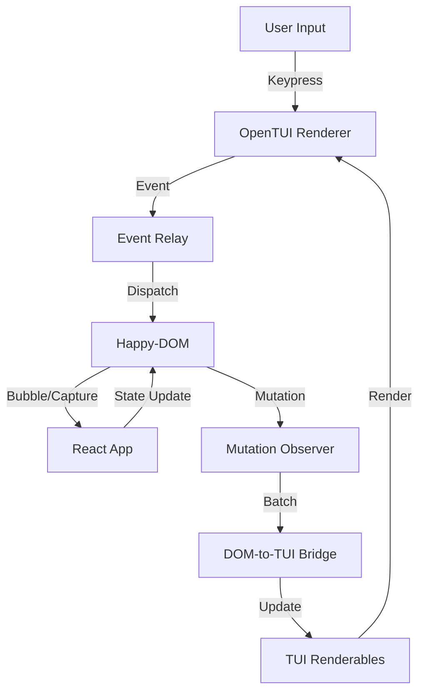

# Design: TUI DOM

## Architecture Overview

The system functions as a unidirectional data flow loop with a bridge for event feedback. It treats the DOM (happy-dom) as the "Source of Truth" for application state and structure, while OpenTUI acts as the "View Layer".



## Module Design

### 1. The Bridge (`DOMToTUIBridge`)

The core orchestrator. It observes the DOM and synchronizes the TUI render tree.

- **Input:** `MutationRecord[]` from `happy-dom`.
- **State:** `NodeMap` (WeakMap<Node, Renderable>) linking DOM nodes to TUI objects.
- **Logic:**
  - `childList`: Creates/removes Renderables. Handles re-parenting.
  - `attributes`: Updates styles via `StyleBridge`.
  - `characterData`: Updates text content.
  - **Optimization:** Batches updates to avoid thrashing the TUI layout engine.

### 2. Style Bridge (`StyleBridge`)

Translates CSS/Tailwind into OpenTUI style properties.

- **Input:** `className` string, `style` object, computed styles.
- **Output:** OpenTUI `StyleProps` (Yoga layout props + ANSI colors).
- **Tailwind Mapping:**
  - Layout: `flex`, `grid` (partial), `block` -> Yoga Flexbox.
  - Spacing: `p-4`, `m-2` -> Cell units (approx 1 unit = 4px).
  - Colors: `bg-red-500` -> Mapped to ANSI via `ThemeMap`.
  - Typography: `font-bold`, `underline` -> ANSI attributes.
- **Theme Map:** Resolves CSS variables (`--primary`) to terminal colors based on active theme.

### 3. Event Relay (`EventRelay`)

Bridges the gap between Terminal input (raw bytes/keys) and DOM events.

- **Listener:** Attaches to OpenTUI's global key handler.
- **Targeting:** Uses `document.activeElement` to determine the event target.
- **Translation:**
  - `Enter` -> `click` (for buttons/links).
  - `Space` -> `click` (for checkboxes/radios).
  - `Tab` -> Moves focus (updates `document.activeElement`).
  - `ArrowUp/Down` -> `keydown` (for custom widget navigation).
  - `Char` -> `input` event (for text fields).
- **Scrolling:** On focus change, calculates the target's position relative to the nearest `ScrollBox` ancestor and updates scroll offsets to ensure visibility.

### 4. Component Mapper

Defines how specific HTML tags translate to TUI primitives.

| HTML Element             | TUI Primitive         | Behavior                                     |
| ------------------------ | --------------------- | -------------------------------------------- |
| `div`, `section`, `main` | `BoxRenderable`       | Container, borders, background.              |
| `span`, `p`, `label`     | `TextRenderable`      | Text rendering, inline styling.              |
| `button`                 | `BoxRenderable`       | Focusable, handles click.                    |
| `input[type="text"]`     | `InputRenderable`     | Native TUI input handling (cursor, editing). |
| `textarea`               | `TextareaRenderable`  | Multi-line editing.                          |
| `div` (overflow: scroll) | `ScrollBoxRenderable` | Scrollable viewport.                         |

## Effect Integration

The system is exposed as an Effect Service for integration into the `effect-native` runtime.

```typescript
interface TuiDom {
  readonly window: Window
  readonly document: Document
  readonly renderer: CliRenderer
  readonly mount: (component: React.ReactElement) => Effect.Effect<void>
}

const TuiDomLive = Layer.effect(
  TuiDom,
  Effect.gen(function*(_) {
    // 1. Initialize Happy-DOM
    // 2. Initialize OpenTUI
    // 3. Start Bridge & EventRelay
    // 4. Return interface
  })
)
```

## Detailed Subsystems

### Focus Management

- **Source of Truth:** `happy-dom`'s `document.activeElement`.
- **Navigation:** `EventRelay` implements `Tab` / `Shift+Tab` logic by querying focusable elements (`a`, `button`, `input`, `[tabindex]`) in DOM order.
- **Visuals:** `StyleBridge` checks `element === activeElement` and applies `focus:*` Tailwind classes if present, or a default focus ring.

### Scrolling Strategy

- **Detection:** `StyleBridge` detects `overflow-y-auto` or `overflow-y-scroll`.
- **Implementation:** Swaps `BoxRenderable` for `ScrollBoxRenderable`.
- **Nested Scrolling:** Supported via Yoga layout. Inner scroll boxes clip content.
- **Auto-Scroll:** `EventRelay` triggers `scrollToView` on the nearest scrollable ancestor when focus moves to an off-screen element.

### HTML Form Controls

- **Input/Textarea:** We use OpenTUI's native input renderables because implementing a text editor from scratch using raw DOM events is inefficient in a TUI. The Bridge syncs the TUI input value back to the DOM `value` attribute.
- **Checkbox/Radio:** Rendered as Text (`[ ]`, `[x]`, `( )`, `(*)`). `EventRelay` handles `Space` key to toggle `checked` attribute in DOM.
